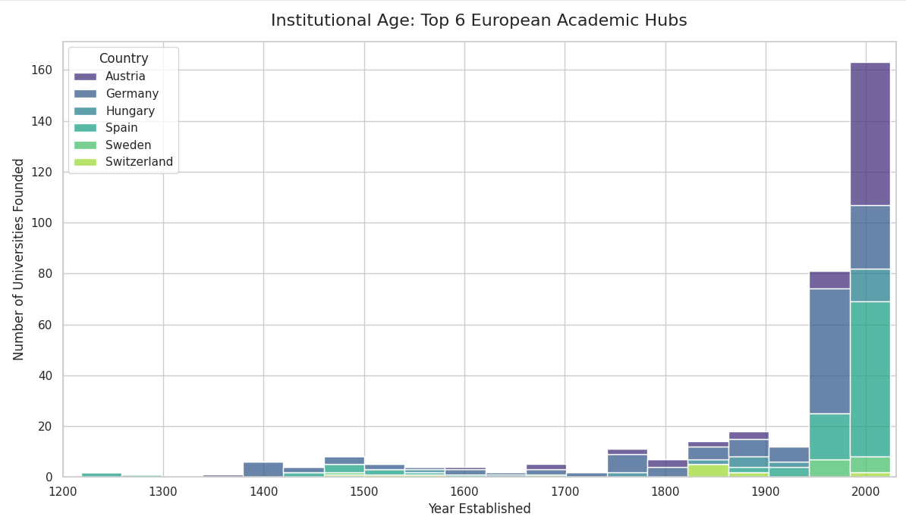

Markdown
# Pan-European Academic Landscape Scraper & Analysis

A end-to-end data engineering and analysis project that dynamically scrapes, cleans, and visualizes 800+ years of higher education history across Europe.

---

##  Project Overview

Rather than relying on pre-cleaned Kaggle datasets, this project takes full ownership of the data lifecycle. Using custom Python web scraping scripts, this pipeline extracts structured higher-education data directly from raw Wikipedia HTML tables across 39 European countries.

The primary objective is to evaluate institutional growth, geographical density, and founding timelines across major European academic hubs.

---

##  Key Features

* **Dynamic URL & Table Parsing:** Programmatically constructs request paths and automatically identifies target table structures despite varying HTML schemas across countries.
* **Polite Scraping Protocols:** Implemented rate-limiting (`time.sleep`) and custom HTTP User-Agent headers to comply with web standards and prevent IP blocking.
* **Automated Data Cleaning:** Utilized Regular Expressions (`re`) to strip citation markers (e.g., `[1]`), normalize text, and isolate numeric 4-digit establishment years.
* **Visual Storytelling:** Generated stacked histogram distributions to track institutional expansion from 1200 AD to the present day.

---

##  Tech Stack & Tools

* **Language:** Python 3.x
* **Web Scraping:** `requests`, `io.StringIO`
* **Data Wrangling:** `pandas`, `re` (Regular Expressions)
* **Visualization:** `seaborn`, `matplotlib`
* **Environment:** Google Colab

---

##  Key Findings & Insights

* **Modern Expansion Surge:** Over **75%** of all active European universities in this dataset were established post-1900, reflecting massive educational democratization in the 20th century.
* **Historical Baseline:** The oldest active institution identified in the dataset is the **University of Salamanca (Spain)**, founded in **1218**.
* **Regional Concentration:** Germany, Spain, and Austria represent the largest clusters of higher education institutions in the analyzed sample.

---

##  Visual Highlights

### Institutional Age: Top European Academic Hubs


---

##  Repository Structure

├── europe_scraper.py                    # Full Python extraction and cleaning script
├── all_europe_academic_landscape.csv    # Cleaned output dataset (400+ records)
├── stacked_histogram_europe.png         # Generated visualization output
└── README.md                            # Project documentation


---

##  How to Run Locally

1. **Clone the repository:**
   ```bash

   git clone [https://github.com/YOUR_USERNAME/european-academic-landscape-scraper.git](https://github.com/YOUR_USERNAME/european-academic-landscape-scraper.git)
Install dependencies:

Bash
pip install pandas requests matplotlib seaborn
Execute the pipeline:

Bash
python europe_scraper.py
